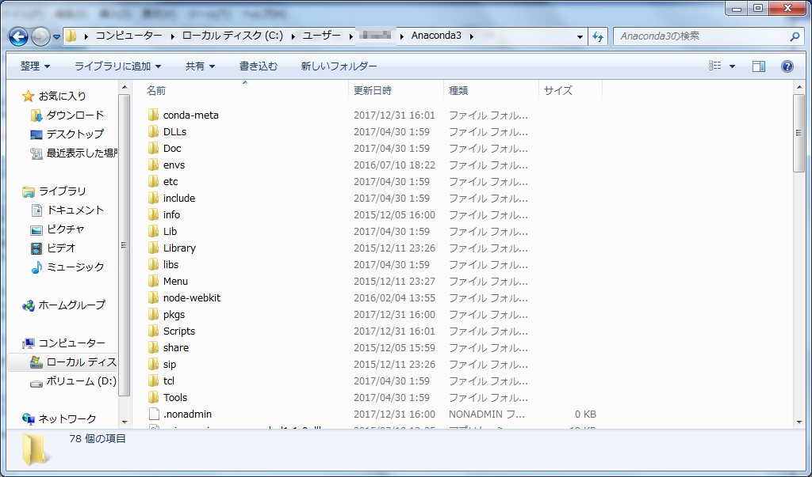

# prerequisites

以下の手順は、Windowsを標準として記載してあります。
Mac,Linuxをご使用の場合は適宜読み替えてください。
以前にAnacondaをインストールしたことのある方は、Anacondaのバージョンを確認して、問題がなければ後半のplotlyのインストールを行ってください。
- ptyhonのバージョン確認方法
```
python --version
```
python3.Xであれば問題ありません。

#### install ANACONDA  
- https://www.anaconda.com/

上記URLの右上のオレンジの枠線から、ダウンロードページへ移動します

- https://www.anaconda.com/download/

ダウンロードページ中段にpythonのversion毎にAnacondaがそれぞれ用意されています。
今回はAnacondaのpython version3.6を使用しますので、上記のサイトから、python3.6 versionをダウンロードしてください。

- ダウンロード時にメールアドレスなどを入力するポップアップが表示されますが、必須ではありません。No Thanksをクリックしても問題ありません。(登録をすると、バージョンの変更などをメールで教えてくれるようになります)


ダウンロード後にAnaconda3-5.0.1-Windows-x86_64.exeをダブルクリックして展開(解凍)しておいて下さい。



User/[user_name]/Anaconda3
標準の場合は、ユーザーディレクトリの配下にAnaconda3というディレクトリが新規に作成されています。


スタートメニューから、anaconda pythonの機能が確認できます。
ここまでで、Anacondaのインストールは出来ています。

#### install Plotly

コマンドプロンプトを起動して

```
conda install plotly
```

として、plotlyのライブラリーを追加してください。


途中確認の表示が出る場合は、y(yes)としてライブラリーの追加を継続してください。


スタート画面から、jupyterをクリックして、起動することを確認してください。

defaultの場合はブラウザのURL欄に下記アドレスが表示されるはずです。

```
localhost:8888
```


以上で、事前準備は終了です。お疲れ様でした。